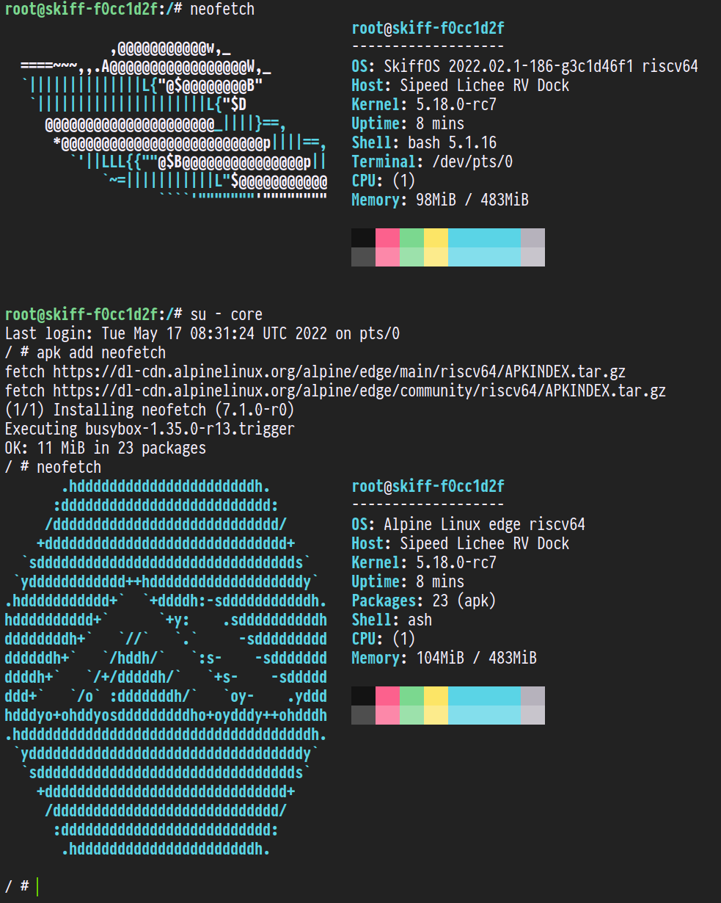

# Sipeed LicheeRV Dock

This configuration package series configures Buildroot to produce a BSP image for the
Sipeed LicheeRV Dock Risc-V Board (and similar).

**Note: this is a RISC-V architecture CPU, not all Docker images will support it.**



References:

 - https://linux-sunxi.org/Sipeed_Lichee_RV
 - https://ovsienko.info/D1/

## Getting Started

Set the comma-separated `SKIFF_CONFIG` variable:

```sh
$ export SKIFF_CONFIG=allwinner/licheerv,core/alpine
$ make configure                   # configure the system
$ make compile                     # build the system
```

Once the build is complete, we will flash to a MicroSD card to boot. You will
need to `sudo bash` for this on most systems.

```sh
$ sudo bash             # switch to root
$ export ALLWINNER_SD=/dev/sdz # make sure this is right! (usually sdb)
$ make cmd/allwinner/d1/format  # tell skiff to format the device
$ make cmd/allwinner/d1/install # tell skiff to install the os
```

You only need to run the `format` step once. It will create the partition table.
The `install` step will overwrite the current Skiff installation on the card,
taking care to not touch any persistent data (from the persist partition). It's
safe to upgrade Skiff independently from your persistent data.

## Building an Image

It's possible to create a .img file instead of directly flashing a SD.

```sh
# must be root to use losetup
sudo bash
# set your skiff workspace
export SKIFF_WORKSPACE=licheerv
# set the output path
export ALLWINNER_IMAGE=./licheerv.img
# make the image
make cmd/allwinner/d1/buildimage
```

The image can then be flashed to the target:

```
# change sdX to, for example, sdb
dd if=licheerv.img of=/dev/sdX status=progress oflag=sync
```

This is equivalent to using the format and install scripts.

The persist partition will be resized to fill the available space on first boot.

## Ethernet over USB

The default configuration enables USB ethernet gadget support.

To setup on the "host" machine:

```sh
$ ip addr add 10.0.0.2/24 dev usb0

# Enabling forwarding internet traffic on behalf of the device:
# some systems may require adjusting iptables:
$ iptables -t nat -A POSTROUTING -s 10.0.0.1/32 -o wlan0 -j MASQUERADE
$ iptables -A FORWARD -s 10.0.0.1 -j ACCEPT
$ echo 1 > /proc/sys/net/ipv4/ip_forward
```
