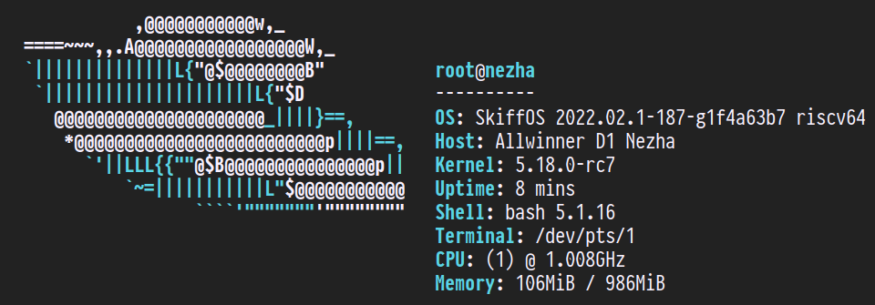

# Allwinner Nezha

This configuration package series configures Buildroot to produce a BSP image for the
Allwinner Nezha Risc-V Board (and similar).

**Note: this is a RISC-V architecture CPU, not all Docker images will support it.**



References:

 - https://linux-sunxi.org/Allwinner_Nezha
 - https://ovsienko.info/D1/
 
# Flashing

Skiff is easiest installed to a SD card. A tool can be used to flash the OS to
the internal EMMC once booted to the SD card. The Nezha system will boot from
the SD card if it is present and contains u-boot.

These commands require root and may need to be run with `sudo bash`.

```
export SKIFF_WORKSPACE=nezha
export ALLWINNER_SD=/dev/sdx # make sure this is correct - i.e. /dev/sdb
make cmd/allwinner/d1/format
make cmd/allwinner/d1/install
```

The "format" command creates the partition layout and installs u-boot. This only
needs to be run once. The "install" command copies the latest Image, dtb, boot
script, initramfs, and modules image to the boot and rootfs partitions. The root
system can be updated without touching the "persist" partition by running
"install" again whenever necessary.


## Building an Image

It's possible to create a .img file instead of directly flashing a SD.

```sh
# must be root to use losetup
sudo bash
# set your skiff workspace
export SKIFF_WORKSPACE=nezha
# set the output path
export ALLWINNER_IMAGE=./nezha.img
# make the image
make cmd/allwinner/d1/buildimage
```

The image can then be flashed to the target:

```
# change sdX to, for example, sdb
dd if=nezha.img of=/dev/sdX status=progress oflag=sync
```

This is equivalent to using the format and install scripts.

The persist partition will be resized to fill the available space on first boot.
